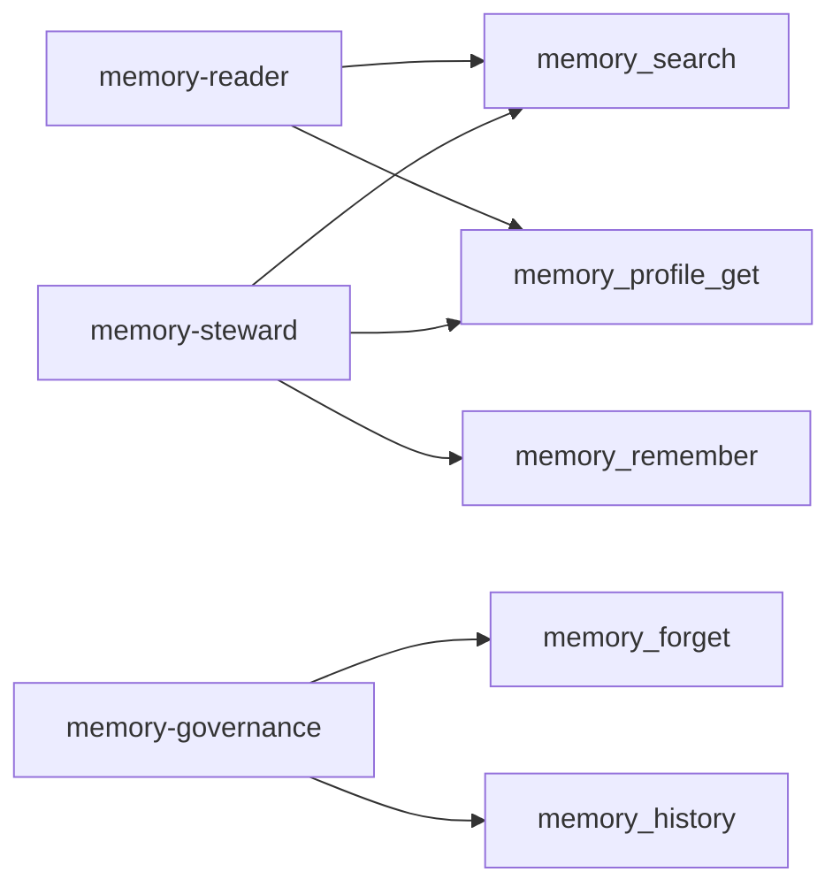

# ADR 0002: MCP capability profiles and tool annotations

## Status

Accepted

## Context

A single MCP catalog at `POST /mcp` let every connected agent discover `memory_search`, `memory_remember`, and `memory_forget` together. OAuth scopes still blocked execution, but discovery is part of the safety boundary for agents: a tool that appears in `tools/list` affects planning even when a later call would 403.

MCP tool annotations (`readOnlyHint`, `destructiveHint`, `idempotentHint`, `openWorldHint`) are host UX hints, not authorization. Absent annotations, clients assume mutate + destructive + non-idempotent + open-world.

RFC 9728 requires protected-resource metadata at a well-known URL formed by inserting `/.well-known/oauth-protected-resource` between the host and the resource path.

## Decision

1. Ship three job-shaped MCP profiles in one gateway process:
   - `memory-reader` → `POST /memory-reader/v1/mcp` (`mnem-reader`): search + profile get
   - `memory-steward` → `POST /memory-steward/v1/mcp` (`mnem-steward`): reader tools + remember
   - `memory-governance` → `POST /memory-governance/v1/mcp` (`mnem-gov`): forget + history
2. Capability is the profile tool allowlist. Unknown tools on a profile return JSON-RPC `-32602`. OAuth scopes remain a second gate inside `MemoryService`.
3. Annotate every tool. Do not enforce policy from annotations.
4. Publish path-inserted RFC 9728 PRM per mounted profile. JWT `aud` may be `AUTH_AUDIENCE` (REST / local token mint) **or** any mounted MCP profile resource URL (so discovery `resource` and RS verification stay aligned). Downstream Google Memory Bank stays on a separate credential.
5. Delete the combined `POST /mcp` and its PRM with no compatibility shim. Optional `MNEM_STEWARD_MCP_PROFILES` mounts a subset.
6. Do not expose Memory Bank instance admin, purge-all, or cross-principal ops on MCP.

Domain structured memory (`MemoryProfile` / `employee-agent`) is unrelated; MCP surfaces are named `McpProfile`.

## Consequences

- Coding agents default to `memory-reader` and cannot discover forget.
- Persist agents use `memory-steward` without seeing destructive tools.
- Forget/history require an explicit governance client configuration.
- Plugin and RFC docs must use profile URLs only.
- Later audit/ops profiles need redacted or non-fact APIs before they ship.

