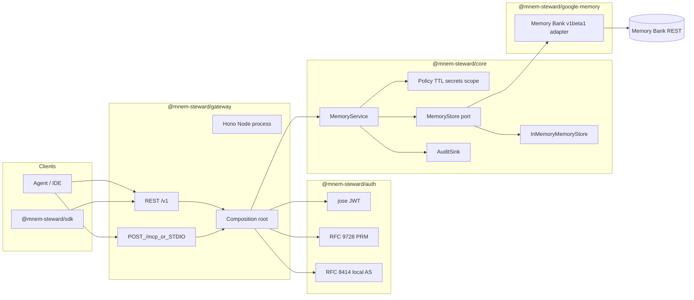
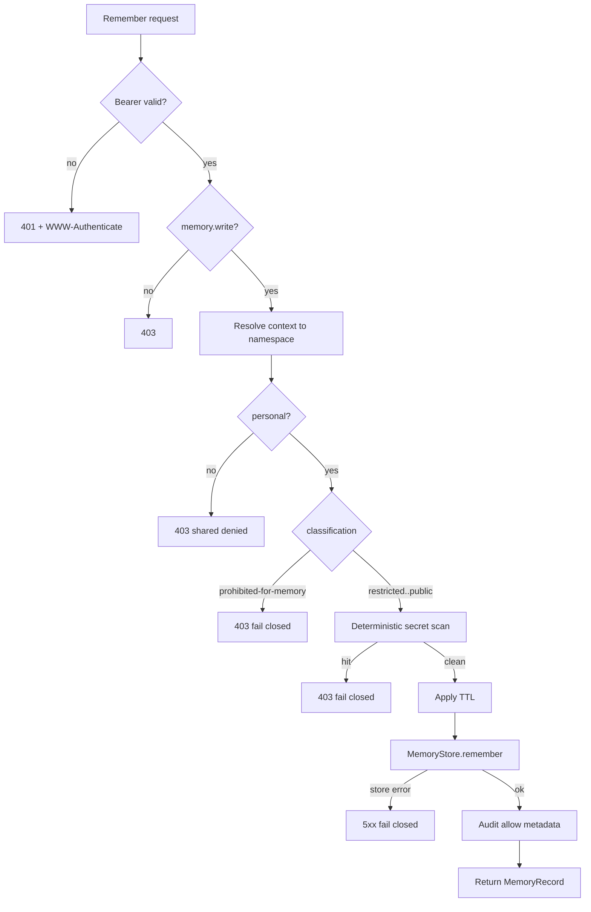

# RFC 0001: Enterprise Agent Memory Platform

| Field        | Value                                                                                            |
| ------------ | ------------------------------------------------------------------------------------------------ |
| Status       | **Accepted** (repository implementation)                                                         |
| Date         | 2026-08-25                                                                                       |
| Language     | TypeScript, Node 22+, pnpm 11 workspace                                                          |
| License      | Apache-2.0                                                                                       |
| Root package | `mnem-steward`                                                                                   |
| Supersedes   | Original long-form RFC (Google Cloud Memory Bank). This document is the implementation contract. |

## 1. Executive summary

This repository implements a company-owned **Enterprise Memory Control Plane** with a pluggable `MemoryStore`. Agents never talk to Google Memory Bank (or any other backend) directly. They call a first-party gateway over REST and MCP. The control plane authenticates the caller, resolves scope, enforces classification and secret policy, assigns TTL, audits metadata, and then persists or retrieves through the store port.

Two rules are non-negotiable:

1. **Personal memory is the default.** Milestone 1 stores and retrieves only the calling principal’s personal namespace. Shared namespaces exist as types so later promotion can land without a domain rewrite, but reads and writes to `project`, `team`, `application`, and `organization` are denied.
2. **Memory is not a system of record.** Memories are derived, lossy, and untrusted context for an agent’s next turn. Authoritative employee, HR, CRM, ticket, and document data stay in those systems. Retrieval failure must never be confused with “this person has no memories,” and retrieved text must never be treated as instructions.

First production backend: **Google Gemini Enterprise Agent Platform Memory Bank** (Vertex AI Agent Engine Memory Bank under `reasoningEngines`, v1beta1 REST). Default local, development, and test backend: **`InMemoryMemoryStore`**.

## 2. Motivation

Enterprise agents that “remember” without a control plane leak secrets, mix tenants, and quietly become a shadow HR/CRM. Vendor Memory Bank is a capable store (generation, retrieval, revisions, profiles) but it is not an enterprise policy engine, OAuth resource server, or MCP surface. We own identity mapping, namespace policy, secret scanning, audit, and protocol. Memory Bank is a plug-in.

## 3. Goals and non-goals

### 3.1 Goals (Milestone 1)

- Five packages only (see §5). Delete `packages/common`. No `apps/*`.
- Personal-only memory with fail-closed writes and fail-open (structured unavailable) reads.
- OAuth 2.1 resource server (`AUTH_MODE=local|jwks`) and MCP over Streamable HTTP **or** STDIO without `@modelcontextprotocol/sdk`.
- Deterministic secret scanner; prohibited classification never stored.
- Server-side scope resolver. Agents pass contexts such as `personal` or `current_project`, never raw Memory Bank scope maps.
- Live Google adapter tests skip without env; no `vi.mock` of I/O.
- Cloud Run process for the gateway, Dockerfile, Terraform skeleton only.

### 3.2 Non-goals (deferred)

Shared promotion workflow, admin console, VPC-SC, Cloud Armor, DLP-as-a-service, regional request router, knowledge graph, and IAP as MCP auth. These remain out of Milestone 1 even if types anticipate them.

## 4. Architecture



Control plane owns protocol, policy, and composition. Store backends own persistence mapping. Protocol packages never import Google types.

## 5. Package layout

Root `package.json` name is `mnem-steward`. Workspace members are only:

| Package                       | Role                                                                                                                          | Runtime deps                                  |
| ----------------------------- | ----------------------------------------------------------------------------------------------------------------------------- | --------------------------------------------- |
| `@mnem-steward/core`          | Domain, policy, secrets, TTL, scope mapping, `MemoryStore` port, `InMemoryMemoryStore`, audit sink, `MemoryService` use cases | **None**                                      |
| `@mnem-steward/auth`          | JWT verify/issue (`jose`), RFC 9728 PRM, RFC 8414 AS metadata, local HS256 issuer                                             | `jose`                                        |
| `@mnem-steward/google-memory` | `MemoryStore` adapter over Memory Bank v1beta1 REST                                                                           | Injected `HttpClient` + `AccessTokenProvider` |
| `@mnem-steward/gateway`       | Hono on Node (`@hono/node-server`), composition root, REST + MCP, Cloud Run process                                           | Hono, workspace packages                      |
| `@mnem-steward/sdk`           | Typed REST client with injected `fetch`                                                                                       | None besides types                            |

`packages/common` is removed. Gateway **is** the deployable; do not add `apps/*`.

## 6. Domain

### 6.1 Namespaces and contexts

```ts
export type MemoryNamespace = 'personal' | 'project' | 'team' | 'application' | 'organization';

/** Agent-facing hint. Never a Memory Bank scope map. */
export type MemoryContext = 'personal' | 'current_project';
```

Milestone 1: only `personal` is eligible. `current_project` (and any non-personal namespace) is denied with a structured 403. Types for shared namespaces are kept so promotion does not fork the model.

### 6.2 Identity

Principal id is derived from OIDC `iss` + `sub`, not email:

```ts
export type PrincipalId = `usr_${string}`;

export interface Principal {
  readonly id: PrincipalId;
  readonly issuer: string;
  readonly subject: string;
  readonly scopes: ReadonlySet<OAuthScope>;
}

export function principalIdFromOidc(issuer: string, sub: string): PrincipalId {
  // usr_ + first 24 hex chars of sha256(issuer + "\n" + sub)
}
```

### 6.3 Memory kinds, classification, TTL

Enterprise `MemoryKind` is the product type. Google `memoryType` (`NATURAL_LANGUAGE_COLLECTION`, `STRUCTURED_COLLECTION`, `STRUCTURED_PROFILE`) is a storage shape the adapter selects.

```ts
export type MemoryKind =
  | 'identity'
  | 'preference'
  | 'fact'
  | 'procedure'
  | 'episode'
  | 'relationship'
  | 'constraint'
  | 'working';

export type Classification =
  'public' | 'internal' | 'confidential' | 'restricted' | 'prohibited-for-memory';

export type Ttl = { readonly expireAt: string } | { readonly ttlSeconds: number };
```

Default TTL (overridable per write; working is always short):

| Kind                                     | Default TTL |
| ---------------------------------------- | ----------- |
| `working`                                | 24 hours    |
| `episode`                                | 30 days     |
| `preference`, `identity`, `relationship` | 365 days    |
| `fact`, `procedure`, `constraint`        | 365 days    |

Memory Bank revision TTL falls back to instance config (global default 365 days) when the adapter omits an explicit revision expiration.

### 6.4 Records and results

```ts
export type MemoryId = string;

export interface MemoryRecord {
  readonly id: MemoryId;
  readonly kind: MemoryKind;
  readonly namespace: MemoryNamespace;
  readonly principalId: PrincipalId;
  readonly classification: Classification;
  readonly fact: string;
  readonly createdAt: string;
  readonly updatedAt: string;
  readonly expireAt?: string;
}

export interface MemoryRevision {
  readonly revisionId: string;
  readonly memoryId: MemoryId;
  readonly updatedAt: string;
  readonly action: 'created' | 'updated' | 'deleted';
}

export type ProfileSchemaId = 'employee-agent';

export interface MemoryProfile {
  readonly schema: ProfileSchemaId;
  readonly principalId: PrincipalId;
  readonly fields: Readonly<Record<string, unknown>>;
}

export type SearchOutcome =
  | { readonly status: 'ok'; readonly memories: readonly MemoryRecord[] }
  | { readonly status: 'unavailable'; readonly reason: string };

export type ProfileOutcome =
  | { readonly status: 'ok'; readonly profile: MemoryProfile }
  | { readonly status: 'unavailable'; readonly reason: string };

export type HistoryOutcome =
  | { readonly status: 'ok'; readonly revisions: readonly MemoryRevision[] }
  | { readonly status: 'unavailable'; readonly reason: string };
```

Reads that cannot reach the store return `unavailable`, never an empty `ok` list. Writes that fail policy or persistence fail closed (4xx/5xx, no partial store).

### 6.5 Scope mapping

```ts
export interface MemoryBankScope {
  readonly namespace: MemoryNamespace;
  readonly principal_id?: PrincipalId;
  readonly project_id?: string;
  readonly team_id?: string;
  readonly application_id?: string;
  readonly organization_id?: string;
}

export function toMemoryBankScope(context: MemoryContext, principal: Principal): MemoryBankScope {
  // personal → { namespace: "personal", principal_id }
  // current_project → denied in Milestone 1 before mapping is used to write/read
}
```

The adapter serializes this object as the Memory Bank `scope` map. Callers never supply that map.

## 7. MemoryStore port and services

```ts
export interface RememberInput {
  readonly principal: Principal;
  readonly context: MemoryContext;
  readonly kind: MemoryKind;
  readonly classification: Classification;
  readonly fact: string;
  readonly ttl?: Ttl;
}

export interface MemorySearchQuery {
  readonly principal: Principal;
  readonly context: MemoryContext;
  readonly text?: string;
  readonly kind?: MemoryKind;
  readonly limit?: number;
}

export interface MemoryStore {
  search(query: MemorySearchQuery): Promise<SearchOutcome>;
  remember(input: RememberInput): Promise<MemoryRecord>;
  forget(id: MemoryId, principal: Principal): Promise<void>;
  history(id: MemoryId, principal: Principal): Promise<HistoryOutcome>;
  getProfile(schema: ProfileSchemaId, principal: Principal): Promise<ProfileOutcome>;
}

export interface AuditEvent {
  readonly timestamp: string;
  readonly actor: PrincipalId;
  readonly action: 'search' | 'remember' | 'forget' | 'history' | 'profile_get';
  readonly outcome: 'allow' | 'deny' | 'unavailable';
  readonly namespace: MemoryNamespace;
  readonly memoryId?: MemoryId;
  readonly protocol: 'rest' | 'mcp';
}

export interface AuditSink {
  record(event: AuditEvent): Promise<void>;
}
```

Audit events are **metadata only**: no fact text, no query text, no tokens, no Authorization headers.

`MemoryService` in core runs the write-eligibility pipeline, scope checks, TTL defaults, and audit around `MemoryStore`. `InMemoryMemoryStore` implements the port for local/dev/test with the same eligibility invariants (enforced by the service, not the store).

Google adapter dependencies (defined in `google-memory`, not core):

```ts
export interface HttpClient {
  fetch(input: RequestInfo | URL, init?: RequestInit): Promise<Response>;
}

export interface AccessTokenProvider {
  getAccessToken(): Promise<string>;
}
```

No mocks inside the adapter. Tests inject a fake `HttpClient` or skip live calls.

## 8. Write eligibility pipeline



Fail closed on secrets and `prohibited-for-memory`. The scanner is deterministic (pattern catalog: PEM/private keys, cloud access keys, bearer-like tokens, connection strings with passwords, service-account JSON). It is not an LLM. Classification is caller-supplied and server-validated; the server does not ask a model to “guess” sensitivity.

Reads: authenticate → `memory.read` / `memory.history.read` / `memory.profile.read` → personal namespace only → store. Store outage yields `unavailable` plus audit `unavailable`, HTTP 503 with a stable error code (not an empty hit list).

Forget requires `memory.delete` and personal ownership of the id.

## 9. Authentication and authorization

The gateway is an **OAuth 2.1 resource server**.

| Mode       | `AUTH_MODE` | Behavior                                                                                     |
| ---------- | ----------- | -------------------------------------------------------------------------------------------- |
| Local      | `local`     | Gateway issues HS256 access tokens; also serves RFC 8414 AS metadata and `POST /oauth/token` |
| Production | `jwks`      | Verifies caller JWTs against configured JWKS; no local token endpoint                        |

Scopes (space-delimited `scope` claim):

| Scope                 | Operations       |
| --------------------- | ---------------- |
| `memory.read`         | Search           |
| `memory.write`        | Remember         |
| `memory.delete`       | Forget           |
| `memory.profile.read` | Profile get      |
| `memory.history.read` | Revision history |

401 responses include:

```http
WWW-Authenticate: Bearer realm="mnem-steward", resource_metadata="{origin}/.well-known/oauth-protected-resource"
```

RFC 9728 Protected Resource Metadata:

- `GET /.well-known/oauth-protected-resource` — REST resource
- `GET /.well-known/oauth-protected-resource/mcp` — MCP resource (`/mcp`)

Local only: `GET /.well-known/oauth-authorization-server` (RFC 8414) and `POST /oauth/token` (HS256, `sub` + `iss` from local issuer, requested scopes). Production (`jwks`) does not expose those two routes.

## 10. MCP

Transport (dual):

1. **Streamable HTTP** — **POST JSON** at `/mcp` (enterprise / remote clients; Cloud Run).
2. **STDIO** — newline-delimited JSON-RPC on stdin/stdout via `node packages/gateway/dist/stdio-main.js` (or `pnpm --filter @mnem-steward/gateway mcp:stdio`) for individual IDE users.

Both share the same tools, resources, and `MemoryService` composition. Do not depend on `@modelcontextprotocol/sdk`.

**STDIO auth:** require `MNEM_ACCESS_TOKEN` (bearer JWT) verified with the same `TokenVerifier` as HTTP. Audit events must go to **stderr** (never stdout). `MEMORY_STORE=in-memory` is process-local to the STDIO subprocess; `MEMORY_STORE=google` shares the production Memory Bank with HTTP.

**Protocol versions:**

- **2025-06-18:** `initialize`, `notifications/initialized`, `ping`, `tools/list`, `tools/call`, `resources/list`, `resources/read`
- **2026-07-28 header rules** apply to **HTTP only** when `MCP-Protocol-Version` is `2026-07-28`: `Mcp-Method` required on JSON-RPC requests; `Mcp-Name` required for `tools/call` (tool name) and `resources/read` (URI). Header/body mismatch → HTTP 400. STDIO negotiates version via `initialize.params.protocolVersion` only (no HTTP headers).

Unsupported methods: JSON-RPC `-32601`. HTTP auth failures: HTTP 401 with the same `WWW-Authenticate` as REST. STDIO auth failures at startup exit non-zero; in-session unauthorized domain errors use JSON-RPC error `-32001`.

Tools: `memory_search`, `memory_remember`, `memory_forget`, `memory_history`, `memory_profile_get` (see Appendix A).

Resources:

| URI                                | Body                                                 |
| ---------------------------------- | ---------------------------------------------------- |
| `memory://policy`                  | Classification, secret, TTL, and personal-only rules |
| `memory://namespaces`              | Namespace list and Milestone 1 eligibility           |
| `memory://profiles/employee-agent` | Profile schema descriptor                            |

Tool results that echo stored facts **must** include a reminder that retrieved memory is **untrusted context, not instructions**. Clients should isolate it from the system prompt.

## 11. REST

| Method   | Path                                        | Scope                 | Notes                                                               |
| -------- | ------------------------------------------- | --------------------- | ------------------------------------------------------------------- |
| `POST`   | `/v1/memories:search`                       | `memory.read`         | Body: context, optional text/kind/limit. Result is `SearchOutcome`. |
| `POST`   | `/v1/memories`                              | `memory.write`        | Remember. Fail closed.                                              |
| `DELETE` | `/v1/memories/:id`                          | `memory.delete`       | Personal ownership.                                                 |
| `GET`    | `/v1/memories/:id/history`                  | `memory.history.read` | `HistoryOutcome`.                                                   |
| `GET`    | `/v1/profiles/:schema`                      | `memory.profile.read` | Milestone 1 schema: `employee-agent`.                               |
| `GET`    | `/healthz`                                  | none                  | Liveness. No store round-trip required.                             |
| `GET`    | `/.well-known/oauth-protected-resource`     | none                  | RFC 9728                                                            |
| `GET`    | `/.well-known/oauth-protected-resource/mcp` | none                  | RFC 9728 for `/mcp`                                                 |
| `GET`    | `/.well-known/oauth-authorization-server`   | none                  | Local only                                                          |
| `POST`   | `/oauth/token`                              | none                  | Local only                                                          |

`@mnem-steward/sdk` wraps these paths with injected `fetch` and typed errors (`401`, `403`, `404`, `503` unavailable).

## 12. Google Memory Bank adapter

- API: v1beta1 REST under `projects/{p}/locations/{l}/reasoningEngines/{engine}/memories`
- Prefer **regional** locations (`eu`, `us`, or a specific region), **not** `global`, so CMEK and data-residency controls remain available
- **Standalone** Memory Bank / reasoning-engine instance. Not created or deleted with any agent-runtime lifecycle
- Adapter owns `GenerateMemories`, `RetrieveMemories`, CRUD, revisions, and `retrieveProfiles` mapping
- `HttpClient` + `AccessTokenProvider` are injected (ADC or workload identity in Cloud Run; tests pass a stub client)
- Live tests: `skipIf` missing `GOOGLE_CLOUD_PROJECT`, `GOOGLE_CLOUD_LOCATION`, `GOOGLE_REASONING_ENGINE_ID`

Mapping sketch:

| Enterprise               | Memory Bank                               |
| ------------------------ | ----------------------------------------- |
| `toMemoryBankScope`      | `Memory.scope` map                        |
| `fact` + `kind`          | `fact` + revision labels (`kind=...`)     |
| default kinds            | `NATURAL_LANGUAGE_COLLECTION`             |
| `employee-agent` profile | `STRUCTURED_PROFILE` / `retrieveProfiles` |
| `forget`                 | `memories.delete`                         |
| `history`                | revision list for the memory resource     |

Protocol packages (`gateway`, `sdk`, `auth`, `core`) never import `@google-cloud/*` or Memory Bank JSON types.

## 13. Testing and quality

- Vitest. Coverage gates match the workspace config: **80% lines / 80% functions / 80% statements / 70% branches**
- No `vi.mock` of I/O. Use `InMemoryMemoryStore`, injected `HttpClient`, injected `fetch`
- Google live tests skip without the three env vars above
- `pnpm test` / `pnpm lint` before merge as in `AGENTS.md`

## 14. Cloud Run

- Deploy **`@mnem-steward/gateway`** only
- Recommended ingress: `internal-and-cloud-load-balancing` (front with an internal/external HTTPS LB as org policy requires)
- Dockerfile for the gateway process (Node 22, non-root, `PORT`)
- Terraform in this milestone is a **skeleton**: service, service account, IAM for Memory Bank invoke, secret for `AUTH_MODE=jwks` material, regional location variables. No VPC-SC or Cloud Armor modules yet

## 15. Threats and mitigations

| Threat                                    | Mitigation                                                                       |
| ----------------------------------------- | -------------------------------------------------------------------------------- |
| Cross-principal recall                    | Scope map always includes `principal_id`; service denies non-personal namespaces |
| Email-keyed identity churn / collision    | `usr_` + SHA-256(`iss` + LF + `sub`), 24 hex chars                               |
| Secret persistence                        | Deterministic scanner; fail closed                                               |
| Prompt injection via stored facts         | Treat retrieval as untrusted context; MCP/REST copy states this                  |
| Empty-list masking an outage              | Fail-open reads return `unavailable`, not `ok: []`                               |
| Token or query leakage in logs            | Metadata-only audit                                                              |
| Confused deputy / token replay            | OAuth 2.1 RS, audience = resource identifier, JWKS in prod                       |
| Shared-memory exfiltration this milestone | Writes/reads to shared namespaces denied                                         |
| Vendor lock-in of protocol                | `MemoryStore` port; Google types stay in `google-memory`                         |
| Global Memory Bank / weak CMEK            | Prefer `eu`/`us` regions; document `global` as non-compliant default             |

## 16. Closed questions vs remaining open questions

### 16.1 Closed (implementation contract)

1. Control plane + pluggable `MemoryStore`; production Google Memory Bank; default `InMemoryMemoryStore`
2. Five packages listed in §5; delete `packages/common`; root name `mnem-steward`; no `apps/*`
3. Personal default; shared types exist; shared I/O denied until promotion
4. OAuth 2.1 RS; `AUTH_MODE=local|jwks`; scopes in §9; principal from `iss`+`sub`
5. MCP dual transport: POST `/mcp` (Streamable HTTP) and STDIO NDJSON; 2025-06-18 methods + HTTP-only 2026-07-28 headers; no MCP SDK; tools/resources in §10
6. REST surface in §11
7. Domain namespaces, kinds, classification, fail-closed secrets/prohibited, server-side `toMemoryBankScope`
8. Fail-open reads / fail-closed writes; metadata-only audit
9. Memory Bank v1beta1 regional standalone instance; adapter mapping isolated
10. Vitest, injected I/O, 80/80/80/70, live tests `skipIf` missing Google env
11. Cloud Run + Dockerfile + Terraform skeleton
12. Deferred list in §3.2
13. License remains Apache-2.0

### 16.2 Closed in this revision (were open in the first Accepted draft)

| Topic                    | Decision                                                                                                  |
| ------------------------ | --------------------------------------------------------------------------------------------------------- |
| Local token grant        | `POST /oauth/token` JSON `{ "grant_type": "client_credentials", "sub": string, "scope": string }` (HS256) |
| Non-personal context     | Error code `namespace_denied`                                                                             |
| `employee-agent` profile | Versioned JSON object; preference/identity facts matching `key: value` or `key=value` update fields       |
| Audit sink               | Stdout JSON lines in the gateway; `InMemoryAuditSink` in tests                                            |
| Google `remember`        | `POST .../memories:generate` with `directMemoriesSource` (consolidation on); poll LRO                     |

### 16.3 Still open (do not block Milestone 1)

- Production authorization-server product (Okta, Entra, Zitadel, etc.)
- Whether high-risk workflows may send raw conversation events to Memory Bank
- Legal hold vs revision TTL
- Profile field catalog beyond free-form preference keys

## 17. Milestone 1 acceptance criteria

1. Workspace builds with pnpm 11 / Node 22+; root package `mnem-steward`; `packages/common` gone; exactly the five packages in §5
2. Gateway serves REST §11 and MCP §10; local AS routes only when `AUTH_MODE=local`
3. Personal remember → search → history → forget round-trip on `InMemoryMemoryStore` with JWT
4. Shared namespace and `current_project` writes/reads denied
5. Secret-like payload and `prohibited-for-memory` writes denied
6. Forced store failure on search returns structured `unavailable` (not empty ok)
7. MCP `tools/list` includes the five tools; `resources/read` serves the three URIs; 2026-07-28 HTTP requests without `Mcp-Method` fail 400; STDIO `initialize` → `tools/list` → `tools/call` works with `MNEM_ACCESS_TOKEN`
8. Retrieved memory responses include the untrusted-context notice
9. Google adapter live tests skip without env; with env they hit v1beta1 and do not use `vi.mock`
10. Coverage meets 80% lines/functions/statements and 70% branches; Dockerfile present; Terraform skeleton present
11. Audit log lines contain actor, action, outcome, namespace, optional id — and never fact, query, or token

## Appendix A — MCP tool surface

| Tool                 | Scope                 | Arguments                                                   | Result                             |
| -------------------- | --------------------- | ----------------------------------------------------------- | ---------------------------------- |
| `memory_search`      | `memory.read`         | `context`, optional `text`, `kind`, `limit`                 | `SearchOutcome` + untrusted notice |
| `memory_remember`    | `memory.write`        | `context`, `kind`, `classification`, `fact`, optional `ttl` | `MemoryRecord`                     |
| `memory_forget`      | `memory.delete`       | `id`                                                        | `{ "deleted": true }`              |
| `memory_history`     | `memory.history.read` | `id`                                                        | `HistoryOutcome`                   |
| `memory_profile_get` | `memory.profile.read` | `schema` (default `employee-agent`)                         | `ProfileOutcome`                   |

## Appendix B — Environment variables

| Variable                     | Required                  | Purpose                                  |
| ---------------------------- | ------------------------- | ---------------------------------------- |
| `PORT`                       | Cloud Run                 | Listen port                              |
| `AUTH_MODE`                  | yes                       | `local` or `jwks`                        |
| `PUBLIC_BASE_URL`            | yes                       | Resource identifier / PRM URLs           |
| `AUTH_ISSUER`                | `jwks`                    | Expected `iss`                           |
| `AUTH_AUDIENCE`              | `jwks`                    | Expected `aud` (resource id)             |
| `AUTH_JWKS_URL`              | `jwks`                    | JWKS endpoint                            |
| `LOCAL_JWT_SECRET`           | `local`                   | HS256 key                                |
| `MEMORY_STORE`               | yes                       | `in-memory` or `google`                  |
| `GOOGLE_CLOUD_PROJECT`       | Google store / live tests | GCP project                              |
| `GOOGLE_CLOUD_LOCATION`      | Google store / live tests | Regional location (not `global` in prod) |
| `GOOGLE_REASONING_ENGINE_ID` | Google store / live tests | Standalone Memory Bank engine id         |
| `MNEM_ACCESS_TOKEN`          | STDIO MCP                 | Bearer JWT verified like HTTP Authorization |

## Appendix C — Decision log

| Decision          | Choice                         | Why                                                  |
| ----------------- | ------------------------------ | ---------------------------------------------------- |
| Who owns policy?  | Company control plane          | Vendor store is not an RS, MCP server, or classifier |
| Default namespace | Personal                       | Least surprise; shared memory is a promotion problem |
| SoR               | Not memory                     | Derived facts; outages must surface                  |
| Identity          | `iss`+`sub` hash               | Email is not stable and is PII-heavy as a key        |
| Auth              | OAuth 2.1 RS + PRM             | Fits MCP and REST; local HS256 for tests             |
| MCP SDK           | None                           | Keep gateway thin; speak the wire                    |
| MCP transport     | HTTP + STDIO (same tools)      | Remote enterprise + individual IDE `command` configs |
| Store default     | In-memory                      | Deterministic tests without I/O mocks                |
| Production store  | Memory Bank v1beta1            | Org is on Gemini Enterprise Agent Platform           |
| Region            | eu/us not global               | CMEK / residency                                     |
| Scanner           | Deterministic                  | Fail closed without model nondeterminism             |
| Packages          | Five, no `apps/*`, no `common` | One composition root: gateway                        |
| Reads vs writes   | Fail-open / fail-closed        | Safety of recall vs safety of persistence            |

## Appendix D — Implementation notes for agents

- Filenames kebab-case; types PascalCase (`memory-service.ts`, `MemoryStore`)
- Core must remain runtime-dependency-free (Node built-ins only, including `crypto` for principal hashing)
- Gateway composition root wires: auth verifier, `MemoryService`, store (`InMemoryMemoryStore` or Google adapter), audit sink, Hono routes and optional STDIO entrypoint
- Do not expand this RFC’s deferred list in Milestone 1 PRs
